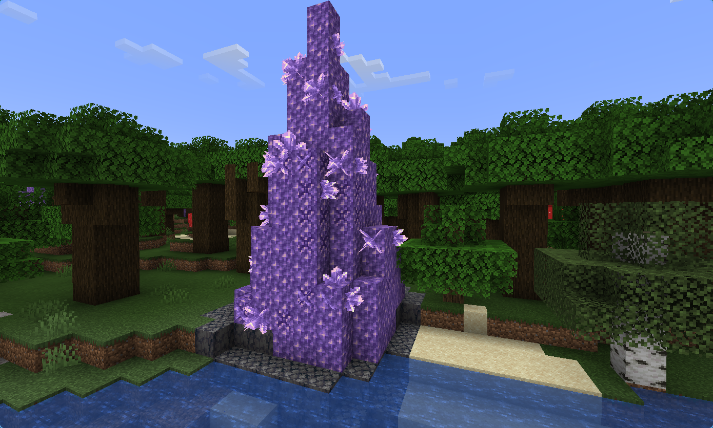
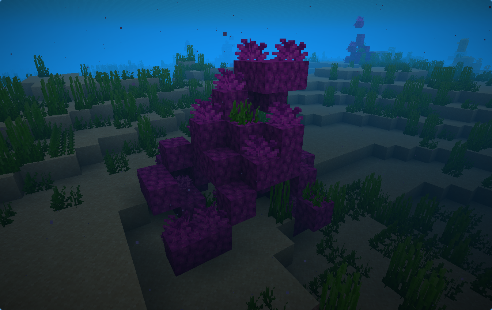
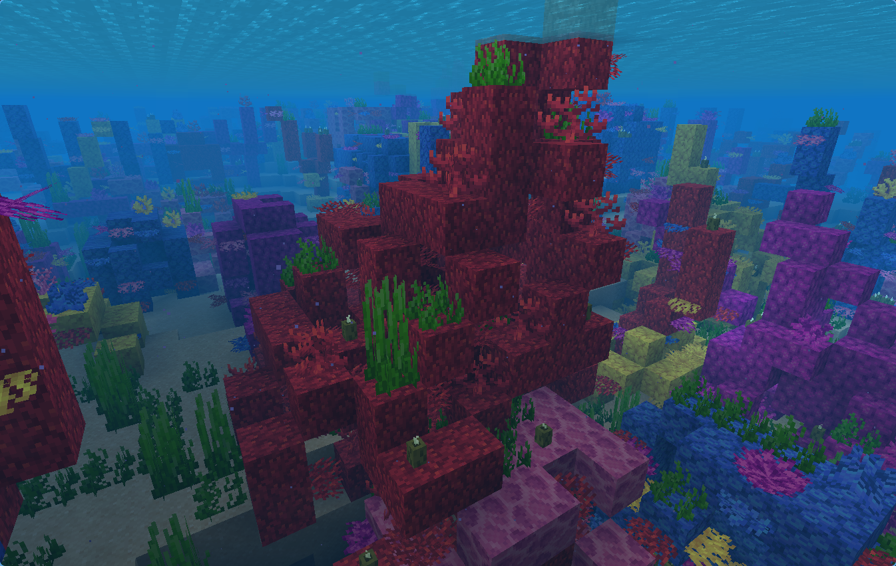
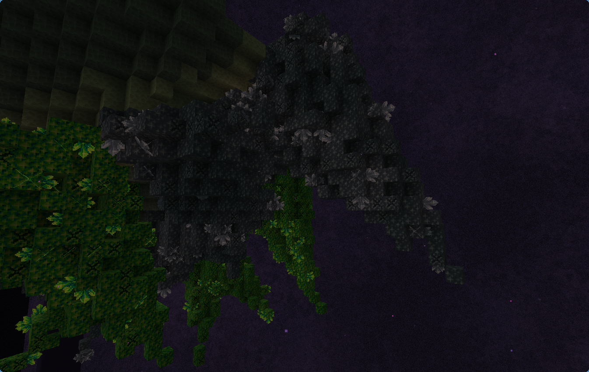

# Crystal Spikes

A NeoForge 1.21.1 mod that adds a highly configurable, datapack-driven crystal spike
worldgen feature with geode-style block providers and a custom placement modifier for finding terrain undersides.



## Feature: `crystalspikes:crystal_spike`

Configured feature JSON (`data/<namespace>/worldgen/configured_feature/<name>.json`):

| Field | Type | Default | Description |
|---|---|---|---|
| `core` | BlockStateProvider | *required* | Spike interior blocks (can be air/water for a hollow spike) |
| `outer_layer` | BlockStateProvider | *required* | Spike shell blocks — applied to spike blocks exposed to space *outside* the spike |
| `surface_decorator` | BlockStateProvider | *(none)* | Blocks attached to the shell's top/bottom faces (e.g. clusters, buds, coral). `facing`/`waterlogged` are set automatically |
| `wall_decorator` | BlockStateProvider | `surface_decorator` | Blocks attached to the shell's *horizontal* faces (e.g. coral wall fans). Falls back to `surface_decorator` when absent |
| `base` | BlockStateProvider | calcite | Blocks that replace exposed anchor blocks around the spike base and roots |
| `base_radius` | IntProvider (1–32) | *required* | Spike base radius |
| `direction` | list of directions | *required* | Main growth direction(s); one is picked at random per spike (`up`, `down`, `north`, `south`, `east`, `west`) |
| `min_angle` / `max_angle` | float (0–180) | `0` | Random tilt range away from the main direction, in degrees. `0` = straight along `direction` |
| `slope_angle` | FloatProvider (0–85) | `26.565` | Cone half-angle in degrees; controls how fast the spike tapers (26.565° = 1:2 taper). `0` = cylinder |
| `height` | IntProvider (1–256) | derived | Spike length along its axis; defaults to the natural cone length `radius / tan(slope_angle)` |
| `root_depth` | int (0–64) | `4` | How far roots extend from the base back toward the mounting surface, so spikes on slopes/ledges don't float. `0` disables |
| `decorator_chance` | float (0–1) | `0.1667` | Chance per shell block to roll decoration |
| `decorator_face_chance` | float (0–1) | `0.5` | Chance per open face of a rolled shell block |
| `anchor_tag` | Block tag | `minecraft:base_stone_overworld` | Blocks the spike can anchor to (and that `base` may replace) |

Notes:

- All BlockStateProvider fields accept any vanilla provider, e.g. `simple_state_provider`
  or `weighted_state_provider` for mixed blocks within one spike.
- Decorators are only placed where they can survive (`canSurvive`), so e.g. sea pickles
  only land on coral blocks and floor fans never float sideways.

### Example

```json
{
  "type": "crystalspikes:crystal_spike",
  "config": {
    "core": {
      "type": "minecraft:simple_state_provider",
      "state": { "Name": "minecraft:calcite" }
    },
    "outer_layer": {
      "type": "minecraft:weighted_state_provider",
      "entries": [
        { "weight": 4, "data": { "Name": "minecraft:amethyst_block" } },
        { "weight": 1, "data": { "Name": "minecraft:budding_amethyst" } }
      ]
    },
    "surface_decorator": {
      "type": "minecraft:weighted_state_provider",
      "entries": [
        { "weight": 3, "data": { "Name": "minecraft:amethyst_cluster" } },
        { "weight": 1, "data": { "Name": "minecraft:large_amethyst_bud" } }
      ]
    },
    "base": {
      "type": "minecraft:simple_state_provider",
      "state": { "Name": "minecraft:basalt" }
    },
    "base_radius": { "type": "minecraft:uniform", "min_inclusive": 2, "max_inclusive": 4 },
    "direction": ["up"],
    "min_angle": 0.0,
    "max_angle": 20.0,
    "slope_angle": { "type": "minecraft:uniform", "min_inclusive": 22.0, "max_exclusive": 30.0 },
    "root_depth": 4,
    "decorator_chance": 0.1667,
    "decorator_face_chance": 0.5
  }
}
```

## Examples

Complete working datapacks (configured feature, placed feature, biome modifier, anchor
tags) are in [`example/datapack/`](example/datapack/)

| | |
|---|---|
|  |  |
|  | |

## Placement modifier: `crystalspikes:under_island`

Finds anchor blocks on the **underside** of terrain (blocks in `anchor_tag` with
air/water/lava below them) — made for hanging spikes under floating islands, without
vanilla's 32-step `environment_scan` limit.

| Field | Type | Default | Description |
|---|---|---|---|
| `anchor_tag` | Block tag | `minecraft:base_stone_overworld` | Blocks that count as anchors |
| `min_y` / `max_y` | int | dimension bounds | Y range to scan |
| `selection` | `"random"` / `"lowest"` / `"highest"` | `"random"` | Which candidate in the column to use |

### Example

```json
{
  "feature": "example:my_spike",
  "placement": [
    { "type": "minecraft:rarity_filter", "chance": 8 },
    { "type": "minecraft:count", "count": { "type": "minecraft:uniform", "min_inclusive": 4, "max_inclusive": 8 } },
    { "type": "minecraft:in_square" },
    { "type": "crystalspikes:under_island", "anchor_tag": "example:end_stones", "min_y": 0, "max_y": 128 },
    { "type": "minecraft:biome" }
  ]
}
```

For surface placement, vanilla's `heightmap` + `environment_scan` (down) works fine. See the coral spikes in the example datapack.
